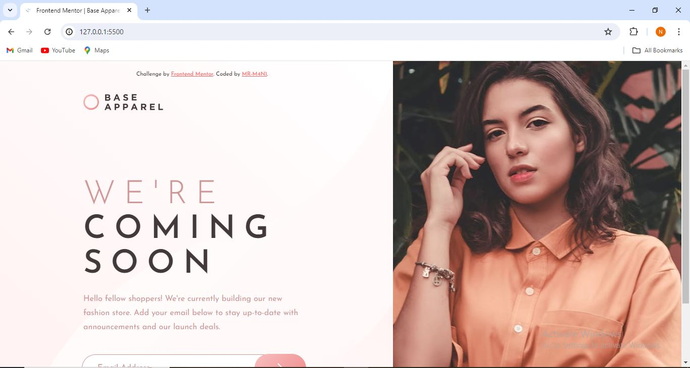

## Table of contents

- [Overview](#overview)
  - [The challenge](#the-challenge)
  - [Screenshot](#screenshot)
  - [Links](#links)
  - [Built with](#built-with)
  - [What I learned](#what-i-learned)
  - [Continued development](#continued-development)
  - [Useful resources](#useful-resources)
- [Author](#author)
- [Acknowledgments](#acknowledgments)

**Note: Delete this note and update the table of contents based on what sections you keep.**

## Overview

-------------------------------------

### The challenge

--------------------------------------

### Screenshot

### Links

- Solution URL: [GIT_URL](https://github.com/MR-M4N1/Base-Apparel_coming-soon-page.)
- Live Site URL: [GIT_LIV]()

### Built with

- Semantic HTML5 markup
- CSS custom properties
- Flexbox
- Mobile-first workflow

### What I learned

----------------------------------------

### Continued development

------------------------------------------

### Useful resources

------------------------------------------

## Acknowledgments

-------------------------------------------
